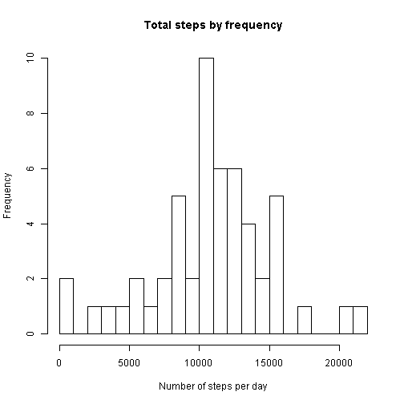

## Loading and preprocessing the data

**Load the data**


```r
unzip("activity.zip")
rawData<-read.csv("activity.csv",stringsAsFactors = FALSE)
```

**Process/transform the data into a format suitable for your analysis**


```r
library(dplyr)
```

```
## 
## Attaching package: 'dplyr'
## 
## The following object is masked from 'package:stats':
## 
##     filter
## 
## The following objects are masked from 'package:base':
## 
##     intersect, setdiff, setequal, union
```

```r
rawData<-tbl_df(rawData)
```


## What is mean total number of steps taken per day?

**For this part of the assignment, you can ignore the missing values in
the dataset.**


```r
filteredData<-filter(rawData,!is.na(steps))
```

**Calculate the total number of steps taken per day**


```r
DateData<-summarize(group_by(filteredData,date),total_steps=sum(steps))
```

**Make a histogram of the total number of steps taken each day**


```r
hist(DateData$total_steps, breaks=20, main="Total steps by frequency", xlab="Number of steps per day", ylab="Frequency")
```

 

**Calculate and report the mean and median total number of steps taken per day**


```r
mean(DateData$total_steps)
```

```
## [1] 10766.19
```

```r
median(DateData$total_steps)
```

```
## [1] 10765
```

### What is the average daily activity pattern?

**Make a time series plot (i.e. `type = "l"`) of the 5-minute interval (x-axis) and the average number of steps taken, averaged across all days (y-axis)**


```r
IntervalData<-summarize(group_by(filteredData,interval),sum=sum(steps),mean=mean(steps))
plot(IntervalData$interval,IntervalData$mean,type="l", main="Average Daily Activity", xlab="Interval", ylab="Average of Steps")
```

 

**Which 5-minute interval, on average across all the days in the dataset, contains the maximum number of steps?**


```r
arrange(IntervalData,desc(sum))[1,1]
```

```
## Source: local data frame [1 x 1]
## 
##   interval
## 1      835
```

## Imputing missing values

**Calculate and report the total number of missing values in the dataset**


```r
Count<-table(is.na(rawData$steps))
Count[names(Count)==TRUE]
```

```
## TRUE 
## 2304
```

**Devise a strategy for filling in all of the missing values in the dataset.**

I'll replace the missing interval data with the averages I calculated from the remaining data.

**Create a new dataset that is equal to the original dataset but with the missing data filled in.**


```r
fixedData<-rawData #copies original dataset
fixedLength<-dim(fixedData)[1] #finds length of dataset
for (i in 1:fixedLength){ #uses length to iterate through dataset
  x<-i%%288 #a fix, since the interval dataset is a different length
  if (x==0){x<-288}
  if (is.na(fixedData$step[i])==TRUE){ #when an NA is found it is replaced, otherwise nothing happens
    fixedData$steps[i]<-IntervalData$mean[x]
  }
}
```


**Make a histogram of the total number of steps taken each day and Calculate and report the mean and median total number of steps taken per day.**


```r
DateData2<-summarize(group_by(fixedData,date),total_steps=sum(steps))
hist(DateData2$total_steps, breaks=20, main="Total steps by frequency", xlab="Number of steps per day", ylab="Frequency")
```

 

```r
mean(DateData2$total_steps)
```

```
## [1] 10766.19
```

```r
median(DateData2$total_steps)
```

```
## [1] 10766.19
```

**Do these values differ from the estimates from the first part of the assignment?**

Yes, except for the mean.

**What is the impact of imputing missing data on the estimates of the total daily number of steps?**

Since the missing data was replaced with averages, the frequency of those values is raised. This affects the median, but not the mean.

## Are there differences in activity patterns between weekdays and weekends?

**For this part the `weekdays()` function may be of some help here. Use the dataset with the filled-in missing values for this part.**

**Create a new factor variable in the dataset with two levels -- "weekday" and "weekend" indicating whether a given date is a weekday or weekend day.**


```r
library(lubridate)
```

```
## Warning: package 'lubridate' was built under R version 3.2.1
```

```r
DayData<-mutate(fixedData,Day=wday(fixedData$date),Weekday=Day!=1&Day!=7)
```

**Make a panel plot containing a time series plot (i.e. `type = "l"`) of the 5-minute interval (x-axis) and the average number of steps taken, averaged across all weekday days or weekend days (y-axis).**


```r
par(mfrow = c(1,2)) # place plots in 1 x 2 grid

WeekdayData<- filter(DayData,Weekday) #filtered by weekdays
WDayIntData<-summarize(group_by(WeekdayData,interval),mean=mean(steps))
plot(WDayIntData$interval,WDayIntData$mean,type="l",main="Weekday Activity", xlab="Interval", ylab="Average of Steps")

WeekendData<-filter(DayData,!Weekday) #filtered by weekends
WEndIntData<-summarize(group_by(WeekendData,interval),mean=mean(steps))
plot(WEndIntData$interval,WEndIntData$mean,type="l",main="Weekend Activity", xlab="Interval", ylab="Average of Steps")
```

 
